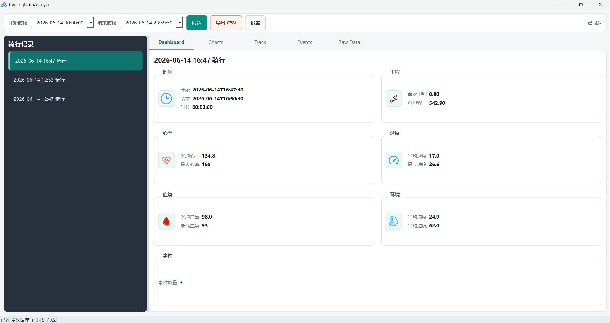
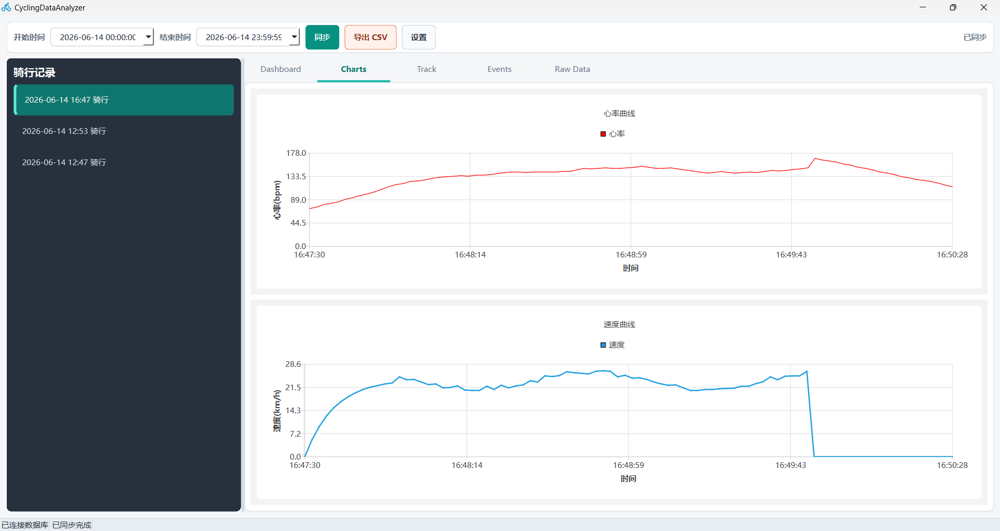
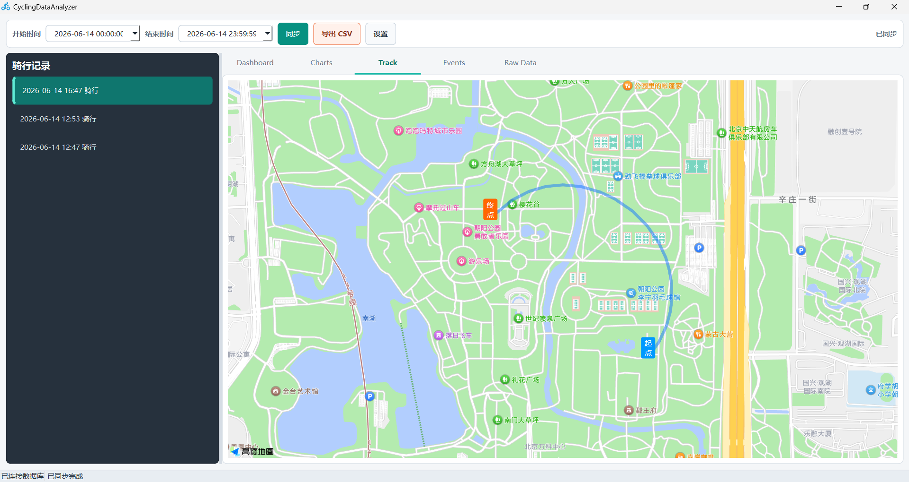
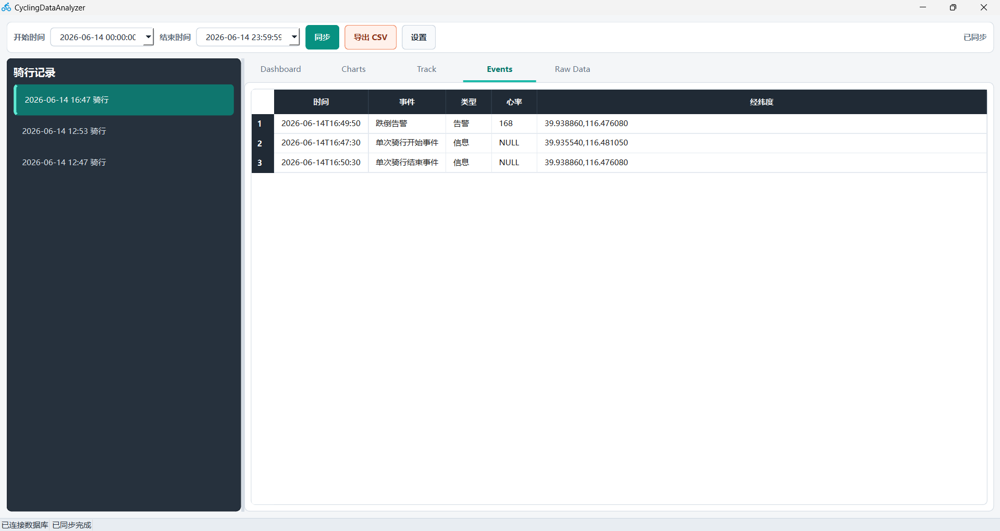
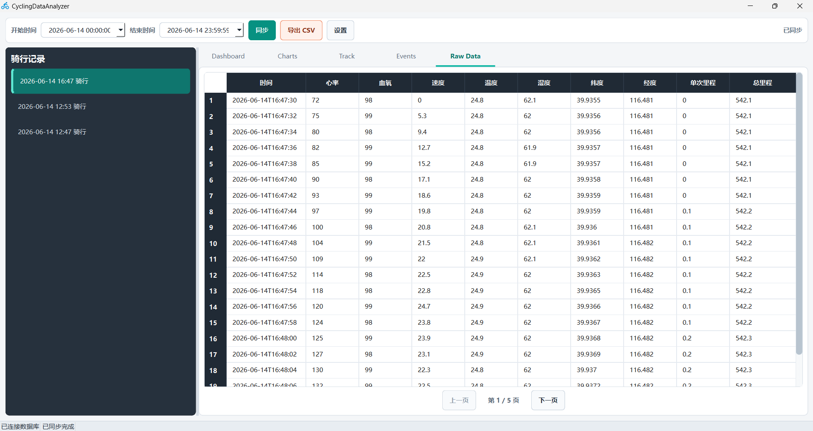

# CyclingDataAnalyzer

CyclingDataAnalyzer 是一个基于 Qt 的骑行数据分析桌面应用，用于从 OneNET 同步骑行传感器数据，并在本地完成存储、分析、展示和导出。

## 功能简介

- 从 OneNET 同步骑行数据。
- 本地保存设备、骑行记录、传感器采样数据和骑行事件。
- Dashboard 页面展示骑行时长、里程、心率、速度、血氧、温湿度和事件数量。
- Charts 页面展示心率和速度趋势图。
- Events 页面展示骑行事件明细。
- Raw Data 页面展示原始数据，并支持分页。
- Track 页面通过 `QWebEngineView` 和高德地图展示骑行轨迹。
- 支持导出 CSV 文件。
- 支持通过设置窗口配置 OneNET 参数和 Raw Data 每页条数。

## 技术栈

- C++17
- Qt 6
- Qt Widgets
- Qt Network
- Qt SQL
- Qt Charts
- Qt WebEngineWidgets
- CMake

## 构建环境

- Qt 6.5 或更高版本
- Windows 下建议使用 MSVC 2022 编译器
- CMake 3.19 或更高版本

注意：项目使用了 `QWebEngineView`，Windows 下需要使用 Qt 的 MSVC 套件。MinGW 套件无法正常使用 Qt WebEngine。

## 构建方式

使用 CMake 配置和编译：

```powershell
cmake -S . -B build -DCMAKE_PREFIX_PATH=<你的 Qt MSVC 安装路径>
cmake --build build --config Debug
```

其中 `CMAKE_PREFIX_PATH` 需要指向本机 Qt MSVC 套件的安装目录，例如 Qt 安装目录下的 `msvc2022_64`。

## 运行配置

程序运行时会生成配置文件：

```text
config/settings.ini
```

该文件用于保存 OneNET 的 Product ID、Device Name、Authorization Token 以及 Raw Data 每页条数。它属于本地运行配置，已经被 `.gitignore` 忽略，不会上传到 GitHub。

## 地图说明

Track 页面使用高德地图 Web API，相关 HTML 文件位于：

```text
src/webhtml/track_map.html
```


## 项目结构

```text
src/
  database/    数据库访问层
  domain/      领域数据结构
  network/     OneNET 网络请求
  service/     同步、分析、映射、导出和骑行构建逻辑
  ui/          主窗口、图表、设置窗口和轨迹视图
  webhtml/     内嵌地图页面
  resources/   QSS 样式文件
icons/         图标资源
resource.qrc   Qt 资源文件
```

## 运行截图








